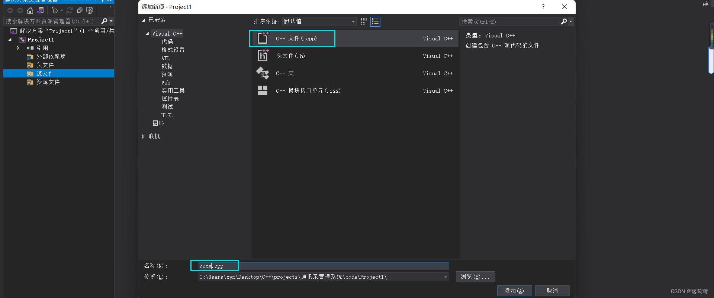

# CppProjects

## 前言

本文章适合初学C++者查看，主要记录了从设计到完成简易通讯录管理系统的过程，相关demo，代码，PDF均可点击[Miraitowax.GitHub](https://github.com/miraitowax/CppProjects)或者[Gitee](https://gitee.com/miraitowax/CppProjects)获取，star一下，共同学习，共同进步！

文章中出现任何错误或想获得源代码文件均可添加笔者QQ（2609276947）联系，也可在文章下方评论，欢迎大家前来交流学习。
# C++实现通讯录管理系统Demo

## 1. 系统需求

通讯录是一个可以记录亲人、好友信息的工具。

主要利用C++来实现一个通讯录管理系统系统中需要实现的功能如下:

* 添加联系人：向通讯录中添加新人，信息包括(姓名、性别、年龄、联系电话、家庭住址）最多记录1000人
* 显示联系人：显示通讯录中所有联系人信息
* 删除联系人：按照姓名进行删除指定联系人
* 查找联系人：按照姓名查看指定联系人信息
* 修改联系人：按照姓名重新修改指定联系人
* 清空联系人：清空通讯录中所有信息
* 退出通讯录：退出当前使用的通讯录

## 2. 创建项目

创建项目步骤如下：

* 创建新项目
* 添加文件

### 2.1 创建项目

打开Visual Studio 2019后，点击创建新项目，创建新的C++项目


创建项目，填写项目名称，选择项目路径


### 2.2 添加文件

添加源文件，右击源文件添加


命名，文件添加完成




完成后，效果如图：


项目创建完成
源文件添加完成后，自动配置scanf需要的预定义语句，可参考[此文章](https://blog.csdn.net/weixin_51389729/article/details/115715155)进行设置

## 3. 菜单功能

功能描述：

用户选择功能的界面

### 步骤：

* 封装函数显示该界面，例：`showMenu()`
* 在main函数中调用封装好的函数

```cpp
#define _CRT_SECURE_NO_WARNINGS 1
#include<iostream>
using namespace std;

//菜单界面显示
void showMenu() {
	cout << "************************" << endl;
	cout << "***** 1. 添加联系人 *****" << endl;
	cout << "***** 2. 显示联系人 *****" << endl;
	cout << "***** 3. 删除联系人 *****" << endl;
	cout << "***** 4. 查找联系人 *****" << endl;
	cout << "***** 5. 修改联系人 *****" << endl;
	cout << "***** 6. 清空联系人 *****" << endl;
	cout << "***** 0. 退出通讯录 *****" << endl;
	cout << "************************" << endl;
}

int main() {
	//菜单的调用
	showMenu();
	return 0;
}
```

## 4. 退出功能

功能描述:退出通讯录系统

思路：根据用户不同的选择，进入不同的功能，可以选择switch分支结构，将整个架构进行搭建

当用户选择0时候，执行退出，选择其他先不做操作，也不会退出程序

```cpp
int main() {
	//用户选择输入
	int select = 0;
	while (true) {
		//菜单的调用
		showMenu();
		cin >> select;
		switch (select) {
		case 1://添加联系人
			break;
		case 2://显示联系人
			break;
		case 3://删除联系人
			break;
		case 4://查找联系人
			break;
		case 5://修改联系人
			break;
		case 6://清空联系人
			break;
		case 0://退出通讯录
			cout << "欢迎下次使用\n";
			system("pause");
			return 0;
			break;
		default:
			break;
		}
	}
	return 0;
}
```

## 5. 添加联系人

功能描述:

实现添加联系人功能，联系人上限为1000人，联系人信息包括（姓名、性别、年龄、联系电话、家庭住址)

添加联系人实现步骤:

* 设计联系人结构体
* 设计通讯录结构体
* main函数中创建通讯录
* 封装添加联系人函数
* 测试添加联系人功能

### 5.1 设计联系人结构体

联系人信息包括（姓名、性别、年龄、联系电话、家庭住址)

```cpp
#include<string>//string头文件
//联系人结构体
struct Person{
    string m_Name;//姓名
    int m_Sex;//性别：1：男 2：女
    int m_Age;//年龄
    string m_Phone;//电话
    string m_Addr;//住址
}
```

### 5.2 设计通讯录结构体

设计时候可以在通讯录结构体中，维护一个容量为1000的存放联系人的数组，并记录当前通讯录中联系人数量设计如下

```cpp
#deifine MAX 1000//最大人数
//通讯录结构体
struct Addressbooks{
    struct Person personArray[MAX];//通讯录中保存的联系人数组
    int m_Size;//通讯录中人员个数
}
```

### 5.3 main函数中创建通讯录

添加联系人函数封装好之后，在main函数中创建一个通讯录变量，这个就是需要一直维护的通讯录

```cpp
//main函数起始位置添加
//创建通讯录结构体变量
Addressbooks abs;
//初始化通讯录中当前人员个数
abs.m_Size = 0;
```

### 5.4 封装添加联系人函数

思路：添加联系人前判断通讯录是否已满，如果满了就不再添加，未满情况将新联系人信息逐个加入到通讯录

```cpp
//1. 添加联系人
void addPerson(Addressbooks* abs) {
	//判断通讯录是否已满，如果满了就不再添加
	if (abs->m_Size == MAX) {
		cout << "通讯录已满，无法添加！" << endl;
	}
	else {
		//添加具体联系人
		//姓名
		string name;
		cout << "请输入姓名：" << endl;
		cin >> name;
		abs->personArray[abs->m_Size].m_Name = name;
		//性别
		cout << "请输入性别：" << endl;
		cout << "1 --- 男" << endl;
		cout << "2 --- 女" << endl;
		int sex = 0;
		while (true) {
			cin >> sex;
			if (sex == 1 || sex == 2) {
				abs->personArray[abs->m_Size].m_Sex = sex;
				break;
			}
			cout << "输入有误，请重新出入！" << endl;
		}
		//年龄
		cout << "请输入年龄：" << endl;
		int age = 0;
		cin >> age;
		abs->personArray[abs->m_Size].m_Age = age;
		//电话
		cout << "请输入联系电话：" << endl;
		string phone;
		cin >> phone;
		abs->personArray[abs->m_Size].m_Phone = phone;
		//住址
		cout << "请输入住址：" << endl;
		string address;
		cin >> address;
		abs->personArray[abs->m_Size].m_Addr = address;
		//更新通讯录人数
		abs->m_Size++;
		cout << "添加联系人成功\n" << endl;

		system("pause");
		system("cls");//清屏
	}
}
```

## 6. 显示联系人

功能描述：显示通讯录中已有的联系人信息

显示联系人实现步骤：

* 封装显示联系人函数
* 测试显示联系人功能

### 6.1 封装显示联系人函数

思路：判断当前通讯录中人员：没有人员，显示记录为空，人数大于0，显示通讯录中的信息

```cpp
//2. 显示联系人
void showPerson(Addressbooks* abs) {
	//判断通讯录中人数是否为空，如果为0，提示记录为空
	//如果不为0，显示记录的联系人信息
	if (abs->m_Size == 0) {
		cout << "当前记录为空" << endl;
	}
	else {
		for (int i = 0; i < abs->m_Size; i++) {
			cout << "姓名：" << abs->personArray[i].m_Name << "\t";
			cout << "性别：" << (abs->personArray[i].m_Sex == 1 ? "男" : "女") << "\t";
			cout << "年龄：" << abs->personArray[i].m_Age << "\t";
			cout << "联系方式：" << abs->personArray[i].m_Phone << "\t";
			cout << "家庭住址：" << abs->personArray[i].m_Addr << endl;
		}
	}

	system("pause");
	system("cls");
}
```

### 6.2 测试显示联系人功能

在switch case语句中，case 2中添加：

```cpp
showPerson(&abs);
```

## 7. 删除联系人

功能描述：按照姓名进行删除指定联系人

删除联系人实现步骤;

* 封装检测联系人是否存在
* 封装删除联系人函数
* 测试删除联系人功能

### 7.1 封装检测联系人是否存在

设计思路：

删除联系人前，我们需要先判断用户输入的联系人是否存在，如果存在删除，不存在提示用户没有要删除的联系人，因此我们可以把检测联系人是否存在封装成一个函数中，如果存在，返回联系人在通讯录中的位置，不存在返回-1。

```cpp
//检测联系人是否存在，如果存在，返回联系人所在数组中的具体位置，不存在返回-1
int isExit(Addressbooks* abs, string name) {
	for (int i = 0; i < abs->m_Size; i++) {
		if (abs->personArray[i].m_Name == name) {
			return i;//找到，返回下标编号
		}
	}
	return -1;//遍历结束未找到，返回-1
}
```

### 7.2 封装删除联系人函数

根据用户输入的联系人判断该通讯录中是否

有此人查找到进行制除，并提示删除成功

查不到提示查无此人。

```cpp
//3. 删除联系人
//检测联系人是否存在，如果存在，返回联系人所在数组中的具体位置，不存在返回-1
int isExit(Addressbooks* abs, string name) {
	for (int i = 0; i < abs->m_Size; i++) {
		if (abs->personArray[i].m_Name == name) {
			return i;//找到，返回下标编号
		}
	}
	return -1;//遍历结束未找到，返回-1
}
//删除联系人
void deletePerson(Addressbooks* abs) {
	cout << "请输入您要删除的联系人：" << endl;
	string name;
	cin >> name;
	int ret = isExit(abs, name);
	//ret != -1 查到了
	//ret == -1 未查到
	if (ret != -1) {
		//数据前移
		for (int i = ret; i < abs->m_Size; i++) {
			abs->personArray[i] = abs->personArray[i + 1];
		}
		//更新通讯录中的人员数
		abs->m_Size--;
		cout << "删除成功\n";
	}
	else {
		cout << "查无此人\n";
	}
	system("pause");
	system("cls");
}
```

## 8. 查找联系人

功能描述：按照姓名查看指定联系人信息

查找联系人实现步骤：

* 封装查找联系人函数
* 测试查找指定联系人

### 8.1 封装查找联系人的函数

实现思路：判断用户指定的联系人是否存在，如果存在显示信息，不存在则提示查无此人。

```cpp
//4. 查找指定联系人信息
void findPerson(Addressbooks* abs) {
	cout << "请输入您要查找的联系人：" < endl;
	string name;
	cin >> name;
	//判断指定的联系人是否存在在通讯录中
	int ret = isExit(abs);
	if (ret != -1) {//找到
		cout << "姓名：" << abs->personArray[ret].m_Name << "\t";
		cout << "性别：" << (abs->personArray[ret].m_Sex == 1 ? "男" : "女") << "\t";
		cout << "年龄：" << abs->personArray[ret].m_Age << "\t";
		cout << "联系方式：" << abs->personArray[ret].m_Phone << "\t";
		cout << "家庭住址：" << abs->personArray[ret].m_Addr << endl;
	}
	else {//未找到
		cout << "查无此人\n" << endl;
	}
	system("pause");
	system("cls");
}
```

### 8.2 测试查找指定联系人

在switch case语句中，case 4中添加：

```cpp
findPerson(&abs);
```

## 9. 修改联系人

功能描述：按照姓名重新修改指定联系人

修改联系人实现步骤：

* 封装修改联系人函数
* 测试修改联系人功能

### 9.1 封装修改联系人函数

实现思路：查找用户输入的联系人，如果查找成功进行修改操作，查找失败提示查无此人

```cpp
//5. 修改指定联系人信息
void modifyPerson(Addressbooks* abs) {
	cout << "请输入您要修改的联系人：" << endl;
	string name;
	cin >> name;
	int ret = isExit(abs, name);
	if (ret != -1) {
		//姓名
		string name;
		cout << "请输入姓名：" << endl;
		cin >> name;
		abs->personArray[ret].m_Name = name;
		//性别
		int sex = 0;
		cout << "请输入性别：" << endl;
		cout << "1 --- 男" << endl;
		cout << "2 ---女" << endl;
		while (true) {
			cin >> sex;
			if (sex == 1 || sex == 2) {
				abs->personArray[ret].m_Sex = sex;
				break;
			}
			cout << "输入有误，请重新输入" << endl;
		}
		//年龄
		int age = 0;
		cout << "请输入年龄：" << endl;
		cin >> age;
		abs->personArray[ret].m_Age = age;
		//电话
		string phone;
		cout << "请输入联系电话：" << endl;
		cin >> phone;
		abs->personArray[ret].m_Phone = phone;
		//地址
		string address;
		cout << "请输入家庭住址：" << endl;
		cin >> address;
		abs->personArray[ret].m_Addr = address;
	}
	else {
		cout << "查无此人\n" << endl;
	}
	system("pause");
	system("cls");
}
```

### 9.2 测试修改联系人功能

在switch case语句中，case 4中添加：

```cpp
modifyPerson(&abs);
```

## 10. 清空联系人

功能描述：清空通讯录中所有信息

清空联系人实现步骤

* 封装清空联系人函数
* 测试清空联系人

### 10.1 封装清空联系人函数

实现思路：将通讯录所有联系人信息清除掉，只要将通讯录记录的联系人数量置为0，做逻辑清空即可。清空联系人代码:

## 11. 代码

```cpp
#define _CRT_SECURE_NO_WARNINGS 1
#include<iostream>
#include<string>
#define MAX 1000
using namespace std;

//联系人结构体
struct Person {
	string m_Name;//性别
	int m_Sex;//性别
	int m_Age;//年龄
	string m_Phone;//电话
	string m_Addr;//住址
};

//通讯录结构体
struct Addressbooks {
	//通讯录中保存联系人数组
	struct Person personArray[MAX];
	//通讯录当前记录的人员个数
	int m_Size;
};

//菜单界面显示
void showMenu() {
	cout << "************************" << endl;
	cout << "***** 1. 添加联系人 *****" << endl;
	cout << "***** 2. 显示联系人 *****" << endl;
	cout << "***** 3. 删除联系人 *****" << endl;
	cout << "***** 4. 查找联系人 *****" << endl;
	cout << "***** 5. 修改联系人 *****" << endl;
	cout << "***** 6. 清空联系人 *****" << endl;
	cout << "***** 0. 退出通讯录 *****" << endl;
	cout << "************************" << endl;
}

//1. 添加联系人
void addPerson(Addressbooks* abs) {
	//判断通讯录是否已满，如果满了就不再添加
	if (abs->m_Size == MAX) {
		cout << "通讯录已满，无法添加！" << endl;
	}
	else {
		//添加具体联系人
		//姓名
		string name;
		cout << "请输入姓名：" << endl;
		cin >> name;
		abs->personArray[abs->m_Size].m_Name = name;
		//性别
		cout << "请输入性别：" << endl;
		cout << "1 --- 男" << endl;
		cout << "2 --- 女" << endl;
		int sex = 0;
		while (true) {
			cin >> sex;
			if (sex == 1 || sex == 2) {
				abs->personArray[abs->m_Size].m_Sex = sex;
				break;
			}
			cout << "输入有误，请重新出入！" << endl;
		}
		//年龄
		cout << "请输入年龄：" << endl;
		int age = 0;
		cin >> age;
		abs->personArray[abs->m_Size].m_Age = age;
		//电话
		cout << "请输入联系电话：" << endl;
		string phone;
		cin >> phone;
		abs->personArray[abs->m_Size].m_Phone = phone;
		//住址
		cout << "请输入住址：" << endl;
		string address;
		cin >> address;
		abs->personArray[abs->m_Size].m_Addr = address;
		//更新通讯录人数
		abs->m_Size++;
		cout << "添加联系人成功\n" << endl;

		system("pause");
		system("cls");//清屏
	}
}

//2. 显示联系人
void showPerson(Addressbooks* abs) {
	//判断通讯录中人数是否为空，如果为0，提示记录为空
	//如果不为0，显示记录的联系人信息
	if (abs->m_Size == 0) {
		cout << "当前记录为空" << endl;
	}
	else {
		for (int i = 0; i < abs->m_Size; i++) {
			cout << "姓名：" << abs->personArray[i].m_Name << "\t";
			cout << "性别：" << (abs->personArray[i].m_Sex == 1 ? "男" : "女") << "\t";
			cout << "年龄：" << abs->personArray[i].m_Age << "\t";
			cout << "联系方式：" << abs->personArray[i].m_Phone << "\t";
			cout << "家庭住址：" << abs->personArray[i].m_Addr << endl;
		}
	}

	system("pause");
	system("cls");
}

//3. 删除联系人
//检测联系人是否存在，如果存在，返回联系人所在数组中的具体位置，不存在返回-1
int isExit(Addressbooks* abs, string name) {
	for (int i = 0; i < abs->m_Size; i++) {
		if (abs->personArray[i].m_Name == name) {
			return i;//找到，返回下标编号
		}
	}
	return -1;//遍历结束未找到，返回-1
}
//删除联系人
void deletePerson(Addressbooks* abs) {
	cout << "请输入您要删除的联系人：" << endl;
	string name;
	cin >> name;
	int ret = isExit(abs, name);
	//ret != -1 查到了
	//ret == -1 未查到
	if (ret != -1) {
		//数据前移
		for (int i = ret; i < abs->m_Size; i++) {
			abs->personArray[i] = abs->personArray[i + 1];
		}
		//更新通讯录中的人员数
		abs->m_Size--;
		cout << "删除成功\n";
	}
	else {
		cout << "查无此人\n";
	}
	system("pause");
	system("cls");
}

//4. 查找指定联系人信息
void findPerson(Addressbooks* abs) {
	cout << "请输入您要查找的联系人：" << endl;
	string name;
	cin >> name;
	//判断指定的联系人是否存在在通讯录中
	int ret = isExit(abs,name);
	if (ret != -1) {//找到
		cout << "姓名：" << abs->personArray[ret].m_Name << "\t";
		cout << "性别：" << (abs->personArray[ret].m_Sex == 1 ? "男" : "女") << "\t";
		cout << "年龄：" << abs->personArray[ret].m_Age << "\t";
		cout << "联系方式：" << abs->personArray[ret].m_Phone << "\t";
		cout << "家庭住址：" << abs->personArray[ret].m_Addr << endl;
	}
	else {//未找到
		cout << "查无此人\n" << endl;
	}
	system("pause");
	system("cls");
}

//5. 修改指定联系人信息
void modifyPerson(Addressbooks* abs) {
	cout << "请输入您要修改的联系人：" << endl;
	string name;
	cin >> name;
	int ret = isExit(abs, name);
	if (ret != -1) {
		//姓名
		string name;
		cout << "请输入姓名：" << endl;
		cin >> name;
		abs->personArray[ret].m_Name = name;
		//性别
		int sex = 0;
		cout << "请输入性别：" << endl;
		cout << "1 --- 男" << endl;
		cout << "2 ---女" << endl;
		while (true) {
			cin >> sex;
			if (sex == 1 || sex == 2) {
				abs->personArray[ret].m_Sex = sex;
				break;
			}
			cout << "输入有误，请重新输入" << endl;
		}
		//年龄
		int age = 0;
		cout << "请输入年龄：" << endl;
		cin >> age;
		abs->personArray[ret].m_Age = age;
		//电话
		string phone;
		cout << "请输入联系电话：" << endl;
		cin >> phone;
		abs->personArray[ret].m_Phone = phone;
		//地址
		string address;
		cout << "请输入家庭住址：" << endl;
		cin >> address;
		abs->personArray[ret].m_Addr = address;
	}
	else {
		cout << "查无此人\n" << endl;
	}
	system("pause");
	system("cls");
}

//6. 清空联系人函数
void cleanPerson(Addressbooks* abs) {
	abs->m_Size = 0;
	//将当前记录的联系人数量置为0，做逻辑清空操作
	cout << "通讯录已清空\n" << endl;
	system("pause");
	system("cls");
}

int main() {
	//创建通讯录结构体变量
	Addressbooks abs;
	//初始化通讯录中当前人员个数
	abs.m_Size = 0;
	//用户选择输入
	int select = 0;
	while (true) {//重复选择选项
		//菜单的调用
		showMenu();
		cin >> select;
		switch (select) {
		case 1://添加联系人
			addPerson(&abs);//利用地址传递，可以修饰实参
			break;
		case 2://显示联系人
			showPerson(&abs);
			break;
		case 3://删除联系人
			deletePerson(&abs);
			break;
		case 4://查找联系人
			findPerson(&abs);
			break;
		case 5://修改联系人
			modifyPerson(&abs);
			break;
		case 6://清空联系人
			cleanPerson(&abs);
			break;
		case 0://退出通讯录
			cout << "欢迎下次使用\n";
			system("pause");//请按任意键继续
			return 0;
			break;
		default:
			break;
		}
	}
	return 0;
}
```

## 12. .exe文件

### Visual Studio生成exe可执行文件

Visual Studio是我们常用的集成开发环境。每当我们要运行我们编写的代码的时候，我们都是先在Visual Studio中打开对应的项目软件，点击`调试`来运行。但是当我们要开发一个软件时，我们并不能让用户做同样的操作，往往是提供一个可执行文件以供执行。

`将已经调试完毕的代码项目生成.exe`

实施步骤：

* 设置解决方案配置为Release
* 修改项目运行库为多线程(/MT)
* 重新生成解决方案
  * 修改生成的可执行文件的名字

### 12.1 设置解决方案配置为Release


### 12.2 修改项目运行库为多线程(/MT)


#### 12.2.1 修改生成的可执行文件的名字


默认为`$(ProjectName)`。如图修改为`通讯录管理系统demo`，修改之后重新生成解决方案即可

### 12.3 重新生成解决方案


之后就会在项目文件目录中多出`Release`文件夹，里面的exe文件就是可执行文件

## 13. 相关报错

* 由于找不到MSVCP140.dll，无法继续执行代码。重新安装程序可能会解决此问题

在Visual Studio中：`调试模式（Debug）选择Multi-threaded Debug (/MTd)，发布模式选择（Release）Multi-threaded DLL (/MD)。`

`/MT使用多线程静态编译，/MD使用多线程和使用DLL文件，/MTd使用多线程静态编译并生成调试信息，/MDd使用多线程和DLL文件并生成调试信息。`

> VS在生成调试模式下的二进制文件时，就会把运行时库的一些代码静态编入，同时这也是为什么debug版本的二进制文件往往非常大的原因。